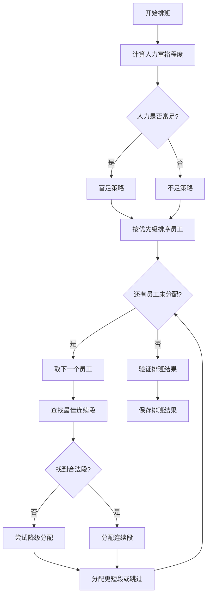

# 大夜排班算法完整文档

## 一、算法概述

大夜排班算法是银行运维排班系统的核心组成部分，负责为上海地区的运维人员生成大夜班（夜班）排班方案。该算法综合考虑了人员资质、生理期限制、休假冲突、连续工作天数、月度公平性等多个维度的约束，是一个多目标约束满足问题。

### 1.1 核心文件架构

大夜排班算法涉及以下核心文件，它们共同构成了完整的排班逻辑：

| 文件路径 | 职责描述 |
|---------|---------|
| `js/rules/nightShiftConfigRules.js` | 统一配置规则模块，定义所有可配置的参数 |
| `js/rules/nightShiftRules.js` | 已废弃的旧规则模块，仅保留兼容性 |
| `js/managers/nightShiftManager.js` | 主管理器，协调整个排班流程（6000+行） |
| `js/solvers/nightShift.js` | 备用求解器，提供替代排班算法 |
| `js/managers/dailyManpowerManager.js` | 每日人力配置矩阵，提供需求数据 |
| `js/state.js` | 全局状态管理，存储人员数据和配置快照 |

### 1.2 算法定位与上下文

大夜排班在整个排班流程中处于最优先的位置。根据系统架构文档，排班流程为：

```
1. BasicRestSolver → 处理休假配额与个人休假
2. NightShiftSolver → 生成大夜排班（最优先）
3. BasicRestSolver → 在夜班结果基础上补休息
4. CSPSolver → 生成白班排班
```

大夜排班的输出结果将直接影响后续的休息排班和白班排班，因此其算法设计需要确保正确性和公平性。

## 二、配置规则体系

### 2.1 配置结构概览

`NightShiftConfigRules` 模块定义了完整的配置结构，采用深度合并机制支持配置的动态更新：

```javascript
NightShiftConfigRules.defaultConfig = {
    // 地区配置（仅上海）
    regions: {
        shanghai: {
            name: '上海',
            aliases: ['上海', '沪', 'SH'],
            dailyMin: 1,        // 每日最少大夜人数
            dailyMax: 2,        // 每日最大大夜人数
            maleConsecutiveDays: 4,   // 男生连续天数
            femaleConsecutiveDays: 3,  // 女生连续天数
            maleMaxDaysPerMonth: 4,    // 男生每月最大天数（硬上限）
            femaleMaxDaysPerMonth: 3    // 女生每月最大天数（硬上限）
        }
    },
    
    // 跨地区配置（预留）
    crossRegion: {
        totalDailyMin: 1,
        totalDailyMax: 2,
        enableBackup: false
    },
    
    // 人力计算配置
    manpowerCalculation: {
        maleDaysPerMonth: 4,      // 男生每月标准大夜天数
        femaleDaysPerMonth: 3,     // 女生每月标准大夜天数
        richThreshold: 0,          // 富裕阈值
        shortageThreshold: 0,      // 不足阈值
        shortageIncreaseDays: 5     // 人力不足时男生可增加到的天数
    },
    
    // 约束规则配置
    constraints: {
        checkBasicEligibility: true,      // 检查基础条件
        checkMenstrualPeriod: true,        // 检查生理期
        checkVacationConflict: true,       // 检查休假冲突
        vacationStrictMode: true,          // 严格模式
        vacationSkipLegal: true,           // 法定休跳过
        vacationSkipReq: true,            // REQ休假跳过
        enforceDailyMin: true,             // 强制执行每日最少人数
        enforceDailyMax: true,             // 强制执行每日最大人数
        allowMaleReduceTo3Days: true,     // 男生可减少到3天
        allowMaleIncreaseTo5Days: true,    // 男生可增加到5天
        arrangementMode: 'continuous',     // 排班模式
        minIntervalDays: 7                 // 最小间隔天数
    },
    
    // 排班优先级配置
    priority: {
        lastMonthWeight: {
            enabled: true,
            dataSource: 'auto',
            segments: [
                { max: 3, priority: 100, targetDays: 4 },
                { min: 4, priority: 50, targetDays: 3 }
            ]
        },
        femalePriority: {
            enabled: true,
            applyCondition: 'sufficient',
            minLastMonthDays: 4,
            reducedDays: 3,
            normalDays: 4
        }
    },
    
    // 严格连续排班配置
    strictContinuous: {
        enabled: false,
        rateSch: 1.0,
        isNul: true,
        postShiftRestDays: 2,
        maxConsecutiveRestLimit: 3,
        randomSeed: null
    }
};
```

### 2.2 配置优先级规则

配置获取遵循以下优先级顺序：

1. **数据库持久化配置**（最高优先级）
2. **内存中当前配置**（`NightShiftConfigRules.currentConfig`）
3. **默认配置**（最低优先级）

配置更新通过 `updateConfig()` 方法实现，使用深度合并策略保留未指定的默认值。

## 三、核心算法流程

### 3.1 排班生成主流程

```javascript
NightShiftManager.generateNightShiftSchedule(dateRange, config = null)
```

**输入参数：**
- `dateRange`: { startDate, endDate } - 排班周期
- `config`: 可选的配置覆盖对象

**输出结果：**
```javascript
{
    schedule: {                           // 排班表 { date: [assignments] }
        "2026-01-01": [{ staffId, name, gender, region, date, shiftType, ... }],
        ...
    },
    stats: {                              // 统计信息
        totalDays: 31,
        shanghai: { totalAssignments, maleAssignments, femaleAssignments, dailyAverage },
        staffStats: { staffId: { name, gender, days } }
    },
    manpowerAnalysis: {                    // 人力分析
        shanghai: { totalSupply, totalDemand, surplus, isSufficient, ... }
    },
    dateRange: { startDate, endDate },
    generatedAt: ISO时间戳
}
```

**执行步骤：**

```
步骤1: 初始化配置
    ↓
步骤2: 计算人力富裕程度 (calculateAllManpowerSufficiency)
    ↓
步骤3: 初始化空排班表
    ↓
步骤4: 为上海分配大夜 (assignNightShiftsForRegion)
    ↓
步骤5: 计算统计信息
    ↓
步骤6: 保存结果到数据库
```

### 3.2 人力富裕程度计算

```javascript
NightShiftManager.calculateManpowerSufficiency(regionKey, dateRange)
```

**算法逻辑：**

1. **获取配置参数**
   - 从 `DailyManpowerManager.matrix` 读取每日需求 `dailyMin` / `dailyMax`
   - 从 `NightShiftConfigRules` 读取人力计算配置

2. **计算总需求人天数**
   ```
   totalDemand = 排班周期天数 × dailyMax
   ```

3. **计算可用人员**
   - 过滤出上海地区员工
   - 排除孕妇、哺乳期人员
   - 按性别分组统计

4. **计算总供给人天数**
   ```
   maleSupply = 可用男生数 × maleDaysPerMonth
   femaleSupply = 可用女生数 × femaleDaysPerMonth
   totalSupply = maleSupply + femaleSupply
   ```

5. **判断人力状态**
   ```
   surplus = totalSupply - totalDemand
   isSufficient = surplus >= 0
   ```

6. **确定调整策略**
   - 富足且 surplus > richThreshold → 减少策略（男生4→3天）
   - 不足 → 增加策略（男生4→5天）
   - 正常 → 正常策略

**输出示例：**
```javascript
{
    region: '上海',
    totalMales: 10,
    totalFemales: 8,
    maleSupply: 40,      // 10人 × 4天
    femaleSupply: 24,     // 8人 × 3天
    totalSupply: 64,
    totalDemand: 62,      // 31天 × 2人/天
    surplus: 2,
    isSufficient: true,
    adjustmentStrategy: 'normal',
    reduceMaleIds: []     // 需要减少天数的男生ID列表
}
```

### 3.3 完美填充算法（Perfect Fill Algorithm）

这是大夜排班的核心算法，用于将员工分配到连续的日期段中。

```javascript
NightShiftManager.assignNightShiftsWithPerfectFill(...)
```

**算法思想：**
1. 不逐天贪心分配，而是预先规划每个员工的连续工作周期
2. 使用3天和4天的组合完美填充排班周期
3. 考虑生理期偏好（上半月/下半月）
4. 优先分配窗口受限的员工，再由无偏好员工填补缺口

**执行流程：**

```
┌─────────────────────────────────────────────────────────────┐
│  步骤1: 过滤可用员工                                     │
│  - 排除 canNightShift === '否' 的员工                     │
│  - 排除孕妇、哺乳期员工                                  │
└─────────────────────────────────────────────────────────────┘
                            ↓
┌─────────────────────────────────────────────────────────────┐
│  步骤2: 按生理期偏好分类员工                               │
│  - lowerHalf: 下半月偏好（只能在1-15号工作）              │
│  - upperHalf: 上半月偏好（只能在16-31号工作）             │
│  - fullMonth: 无偏好（全月可用）                          │
└─────────────────────────────────────────────────────────────┘
                            ↓
┌─────────────────────────────────────────────────────────────┐
│  步骤3: 窗口匹配与分配                                    │
│  - 先分配 lowerHalf → 下半月窗口（1-15号）                │
│  - 再分配 upperHalf → 上半月窗口（16-31号）               │
│  - 最后分配 fullMonth → 填补缺口                          │
└─────────────────────────────────────────────────────────────┘
                            ↓
┌─────────────────────────────────────────────────────────────┐
│  步骤4: 连续段分配                                        │
│  - 对每个员工查找最佳连续段（3天或4天）                   │
│  - 检查休假冲突、生理期冲突                               │
│  - 检查每日人数上限                                      │
└─────────────────────────────────────────────────────────────┘
                            ↓
┌─────────────────────────────────────────────────────────────┐
│  步骤5: 统计与验证                                        │
│  - 计算每天分配人数                                       │
│  - 统计不足天数                                         │
│  - 返回分配结果                                          │
└─────────────────────────────────────────────────────────────┘
```

### 3.4 严格连续排班算法

当 `strictContinuous.enabled = true` 时启用，提供更强的连续性保证。

```javascript
NightShiftManager.generateStrictContinuousSchedule(dateRange)
```

**核心特点：**
1. 所有大夜排班必须是连续的，绝不打散分配
2. 支持开工率控制（`rateSch`）
3. 支持精英轮空策略（`isNul`）
4. 支持排班后遗症管理（大夜后强制休整期）

**算法流程：**

```javascript
async function generateStrictContinuousSchedule(dateRange) {
    // 1. 获取配置参数
    const rateSch = strictConfig.rateSch || 1.0;
    const maxActiveDays = Math.ceil(totalDays * rateSch);
    
    // 2. 创建员工对象
    const employees = this._createEmployeeObjects(staffData, personalRequests, dateRange, totalDays);
    
    // 3. 计算目标天数（供需平衡和轮空逻辑）
    this._calculateTargets(employees, totalDays, dailyTarget, maxActiveDays, isNul);
    
    // 4. 生成分布掩码（离散分段模式）
    const preferredMask = this._generateBlockMask(totalDays, maxActiveDays);
    
    // 5. 按优先级排序员工
    activeEmployees.sort((a, b) => {
        // 最难排的先排：请假天数多 > 目标天数多 > 休息优先级低
    });
    
    // 6. 为每个员工分配连续大夜
    for (const emp of activeEmployees) {
        this._scheduleSingleStrictContinuous(emp, ...);
    }
}
```

**排班后遗症管理：**
```javascript
_checkPostShiftRestConstraint(emp, endIdx, totalDays, postShiftRestDays, maxConsecutiveRestLimit, unavailable) {
    // 检查大夜结束后是否会连续休息超过 maxConsecutiveRestLimit 天
    // 如果超标则放弃该时间段
}
```

### 3.5 人员资格检查

```javascript
NightShiftManager.checkEligibility(staff, date, regionKey, dateRange, manpowerInfo)
```

**检查项目（按优先级）：**

1. **基础条件检查**
   - `canNightShift` 标记
   - 孕妇排除
   - 哺乳期排除

2. **生理期检查（女生）**
   - 上半月偏好 → 1-15号不可排
   - 下半月偏好 → 16-31号不可排

3. **休假冲突检查**
   - ANNUAL（年假）→ 冲突
   - LEGAL（法定休）→ 冲突
   - REQ（指定休假）→ 冲突

4. **连续周期检查**
   - 检查排班周期结尾约束
   - 允许在周期末尾按标准连续天数开始

## 四、算法优化与改进建议

### 4.1 当前算法存在的问题

#### 4.1.1 配置冗余与不一致

**问题描述：**
`NightShiftRules` 模块已被标记为废弃，但仍保留大量兼容代码，导致配置获取逻辑复杂：

```javascript
// nightShiftSolver.js 中的配置获取逻辑
if (typeof NightShiftConfigRules !== 'undefined') {
    configRules = NightShiftConfigRules.getConfig();
} else if (typeof NightShiftRules !== 'undefined') {
    configRules = NightShiftRules.getRules();  // 废弃的兼容层
}
```

**改进建议：**
1. 完全移除 `NightShiftRules` 模块
2. 统一使用 `NightShiftConfigRules` 作为唯一配置源
3. 在代码中添加配置迁移脚本

#### 4.1.2 两套夜班生成路径并存

**问题描述：**
系统中存在两套夜班生成路径，格式可能不兼容：

| 路径 | 输出格式 | 使用场景 |
|-----|---------|---------|
| `NightShiftManager` | `{ date: [assignments] }` | 大夜配置管理页面 |
| `NightShiftSolver` | `{ staffId: { date: 'NIGHT' } }` | ScheduleDisplayManager |

**改进建议：**
1. 在 `NightShiftSolver` 中添加格式转换逻辑
2. 统一使用按日期组织的格式作为标准格式
3. 添加格式验证步骤

#### 4.1.3 硬上限与目标天数混淆

**问题描述：**
代码中存在 `maxDaysPerMonth`（硬上限）和 `targetDays`（目标天数）两个概念，逻辑容易混淆：

```javascript
// 检查硬上限
if (currentDays >= maxDaysPerMonth) {
    continue;  // 达到硬上限，跳过
}

// 检查目标天数
if (currentDays >= targetDays) {
    continue;  // 达到目标，跳过
}
```

**改进建议：**
1. 明确区分约束类型：
   - **硬约束**（不可违反）：硬上限、每日人数、休假冲突
   - **软约束**（尽量满足）：目标天数、连续天数
2. 添加约束类型注释
3. 在验证函数中分别处理

#### 4.1.4 周期末尾处理不够灵活

**问题描述：**
当前周期末尾处理策略可能导致后续几天无人可用：

```javascript
// checkPeriodEndConstraint 中的逻辑
if (daysUntilEnd < consecutiveDays) {
    // 允许开始，但可能导致后续天无法排满
    return { canStart: true, ... };
}
```

**改进建议：**
1. 在周期末尾使用更智能的策略：
   - 短周期适配：允许分配较短的连续段
   - 轮换模式：确保每天都有新人员开始
2. 添加周期末尾专用分配策略

#### 4.1.5 状态同步问题

**问题描述：**
`Store.state.nightShiftConfigs` 和 `NightShiftConfigRules.currentConfig` 可能不同步：

```javascript
// viewConfigEntry 中的逻辑
if (config.nightShiftConfig) {
    NightShiftConfigRules.setConfig(config.nightShiftConfig);
}
```

**改进建议：**
1. 添加状态同步钩子
2. 在配置变更时自动同步到所有引用点
3. 添加配置版本号用于快速校验

### 4.2 算法优化建议

#### 4.2.1 添加回溯机制

**当前问题：**
完美填充算法使用贪心策略，可能在某些情况下无法找到最优解。

**优化方向：**
```javascript
// 添加简单的回溯尝试
function assignWithBacktracking(staffList, window, ...) {
    const result = greedyAssign(staffList, window);
    
    if (!result.isComplete) {
        // 尝试调整分配
        return backtrackAdjust(result, staffList, window);
    }
    return result;
}
```

#### 4.2.2 支持多目标优化

**当前问题：**
优先级排序仅考虑上月夜班天数，缺乏多维度公平性考量。

**优化方向：**
```javascript
// 计算综合优先级分数
function calculatePriorityScore(staff) {
    const lastMonthWeight = 0.4;      // 上月夜班权重
    const holidayWorkWeight = 0.3;      // 节假日工作权重
    const consecutiveRestWeight = 0.3;  // 连续休息权重
    
    return (
        staff.lastMonthDays * lastMonthWeight +
        staff.holidayWorkDays * holidayWorkWeight +
        staff.consecutiveRestDays * consecutiveRestWeight
    );
}
```

#### 4.2.3 添加约束松弛机制

**当前问题：**
当约束完全无法满足时，算法直接失败或给出警告。

**优化方向：**
```javascript
// 软约束松弛
function relaxConstraints(constraints) {
    const relaxed = { ...constraints };
    
    // 尝试放宽软约束
    if (!constraints.canSatisfyDailyMin) {
        relaxed.dailyMin = Math.max(1, constraints.dailyMin - 1);
    }
    
    return relaxed;
}
```

### 4.3 代码质量改进

#### 4.3.1 统一命名规范

**建议统一的前缀：**
- 配置获取方法 → `get*Config()`
- 状态检查方法 → `is*()` / `has*()`
- 分配方法 → `assign*()`
- 统计方法 → `calculate*()`

#### 4.3.2 添加算法注释

对复杂算法添加详细注释，包括：

```javascript
/**
 * 完美填充算法 - 将员工分配到连续日期段
 * 
 * 算法思想：
 * 1. 优先分配窗口受限的员工（下半月偏好 → 上半月偏好 → 无偏好）
 * 2. 使用3天/4天的组合填充周期
 * 3. 确保每天都有足够的人数
 * 
 * @param {Array} staffWithWindows - 按窗口分类的员工
 * @param {Array} dateList - 日期列表
 * @param {Object} schedule - 排班表（会被修改）
 * @param {string} regionKey - 地区代码
 * @param {Object} dateRange - 日期范围
 * @param {number} dailyTarget - 每天目标人数
 * @returns {Object} 分配结果
 */
```

#### 4.3.3 增强单元测试覆盖

建议为以下场景添加单元测试：

| 测试场景 | 验证点 |
|---------|---------|
| 人力富足分配 | 男生减少到3天 |
| 人力不足分配 | 男生增加到5天 |
| 生理期限制 | 上/下半月偏好员工正确跳过 |
| 休假冲突 | 休假当天不排大夜 |
| 周期末尾 | 连续天数正确调整 |
| 人数限制 | 每日人数不超上限 |
| 硬上限控制 | 月度天数不超限制 |

### 4.4 文档改进建议

#### 4.4.1 算法流程图

建议使用 Mermaid 或类似工具绘制流程图：



#### 4.4.2 配置说明文档

建议为每个配置项添加详细的说明和示例：

```markdown
### maleMaxDaysPerMonth（男生每月最大天数）

**类型：** 整数  
**范围：** 3-7  
**默认值：** 4

**说明：**
- 男生本月大夜班的天数硬上限
- 达到此天数后，该员工本月不再分配任何大夜
- 与 `maleConsecutiveDays`（连续天数）不同

**示例：**
```
maleMaxDaysPerMonth = 4
// 张三本月已排4天大夜，无论如何不再排第5天
```
```

## 五、总结

大夜排班算法是一个复杂的约束满足问题，涉及人员筛选、约束检查、连续段分配等多个环节。当前实现通过完美填充算法和严格连续排班两种模式提供了灵活的排班能力，但仍存在配置冗余、状态同步、算法健壮性等方面的问题。

建议按以下优先级进行改进：

1. **高优先级**：统一配置源，移除 `NightShiftRules` 兼容层
2. **高优先级**：解决两套生成路径的格式兼容问题
3. **中优先级**：添加回溯机制增强算法健壮性
4. **低优先级**：添加多目标优化和约束松弛机制

通过以上改进，可以使大夜排班算法更加清晰、健壮和易于维护。
